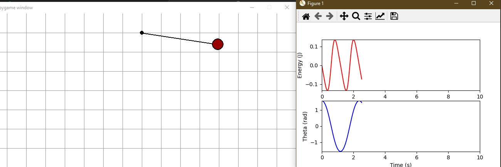

# Pendulum Simulation

requirements:
```bash
pip install -r requirements.txt
```

run:
```bash
python visualize.py
```




## reference:
used this code for this tutorial as a 

|code|youtube|
|---|---|
|[source code](https://pastebin.com/zTZVi8Yv)| [youtube link](https://www.youtube.com/watch?v=vlrVB5X_bcM)
|


